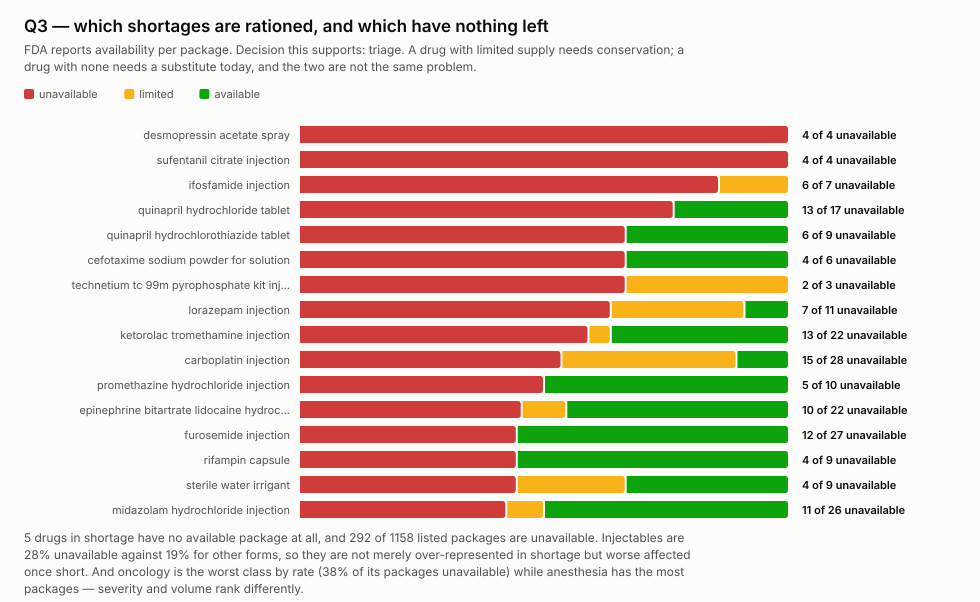
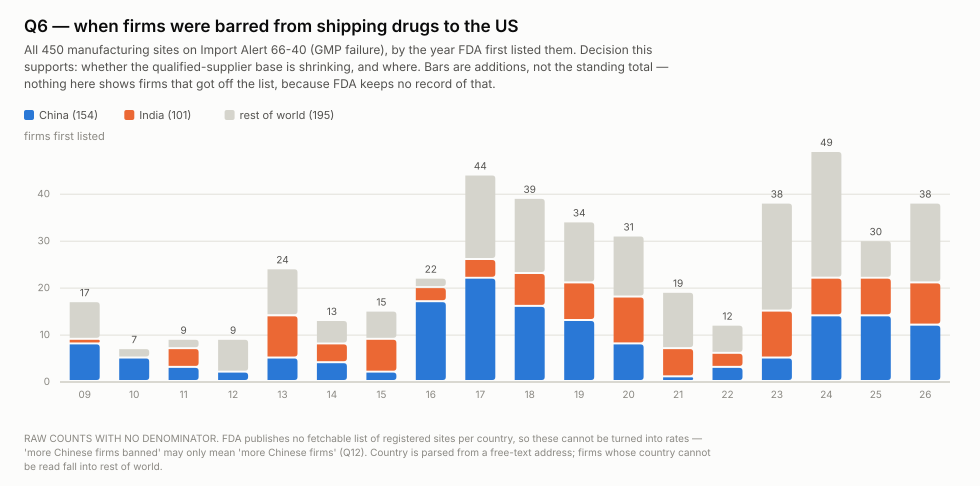
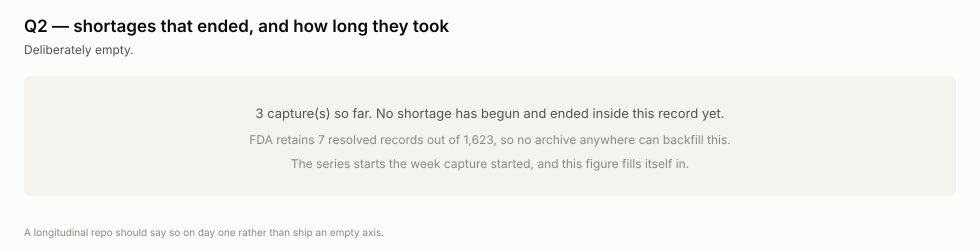
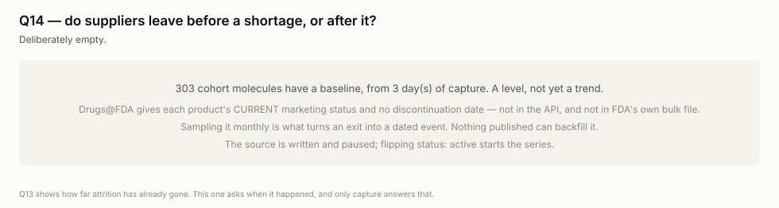

# wss-drug-scarcity

**Which medicines America cannot get, and for how long** — captured weekly,
because the FDA deletes the answer.

FDA publishes the drugs in shortage *today*. When a shortage ends, the record
leaves the feed. On 2026-08-31 the openFDA endpoint held **1,173 Current, 443
To Be Discontinued and 7 Resolved** — seven, across fourteen years of shortage
management. "How long does a US drug shortage last?" is a question nobody can
answer, including the FDA. This repo starts answering it.

> **Two things to know before quoting any figure here.** A shortage is recorded
> per *package NDC* and `initial_posting_date` is when FDA first posted that
> package, not when supply failed — read every duration as **time on FDA's
> list**. And counts of firms have **no denominator**: FDA publishes no
> fetchable list of registered establishments per country, so "China 154" is a
> count and never a rate (Q12).

## Where this disagrees with the record

FDA's feed is the official account of US drug shortages, and it is also the
only account. When a shortage ends the record leaves, so the official answer to
*"how many US drug shortages ended last year"* is **seven** — not because seven
ended, but because seven is what the feed retains.

This repo will disagree with that number using nothing but the same feed,
sampled weekly. Each capture is a dated observation that a package was listed;
its absence from the following capture is a dated observation that it was not.
After twelve months the claim is: **the official record retains N resolved
shortages; continuous observation of that same record found M.**

That is the product. Not better data than FDA — *the same data, held.* The
disagreement is between the record and its own history, and it is available
only to someone who was watching while it happened.

## Questions this exists to answer

A source that answers no question gets dropped. A question nothing answers is
the next thing to build. Append freely.

| # | Question | Status |
| --- | --- | --- |
| Q1 | Mean shortage duration, per substance and per class | needs ~12 months — **the founding question** |
| Q2 | Which shortages resolve, and which never do? | needs ~12 months |
| Q3 | How severe is each shortage right now? | **answered: 7 drugs have no available package at all** |
| Q4 | Which suppliers are fragile? | reframed — count suppliers per substance, never track company identity |
| Q5 | Does an import ban predict a shortage? | needs ~12 months — cross-section gives 3 matches of 448, no causation |
| Q6 | How long do firms stay banned, and who gets off? | needs ~26 weeks — additions dated, **removals destroyed** |
| Q7 | How concentrated is supply per drug? | answerable — 6 drugs are down to one listed package |
| Q8 | Which dosage forms are fragile, against a benchmark? | **answered: injectables are 7.6% of products, 71% of shortages** |
| Q9 | Is the shortage list maintained, or stale? | **answered: 1,010 of 1,623 records touched within 8–30 days** |
| Q10 | Do recalls precede shortages? | needs ~12 months — source not yet added |
| Q11 | Is scarcity a US artefact or global? | blocked — EMA shortage page 404s, needs casing |
| Q12 | What share of a country's registered sites are banned? | blocked — DECRS is JavaScript-gated, no public denominator |
| Q13 | **Why doesn't someone else just make it?** | **answered: 51% of every product ever approved for these drugs is discontinued** |
| Q14 | Do suppliers leave *before* a shortage or after? | source built, cohort frozen, **paused pending activation** |
| Q15 | How big is the gap, in units? | **not observable — nobody publishes demand** |
| Q17 | How far does the official resolved-shortage count diverge from observed resolutions? | needs ~12 months — **the divergence claim**, see above |
| Q16 | Which shortages mean-revert, and which stop? | forward: capture builds it. backward: **tested and failed** |

Q15 and Q16 look answerable and are not. Nobody publishes demand, so there is
no gap to compute; and reconstructing ended episodes from Medicaid volume was
tried and fails — dopamine's volume *rose* through two years of its shortage,
because Medicaid is outpatient data and this list is 71% hospital injectables.

## What you can build

All figures come from [examples/visualize.py](examples/visualize.py) — stdlib
only, deterministic, regenerated from the derived table. Each one names the
drugs and states the decision it supports, because a count of drugs answers a
surface question and sends the reader back for the names.


**Q1.** The 18 longest-running shortages, named, coloured by class. Every one
is an injectable, and anaesthesia and analgesia dominate the eight-year tail.


**Q1, the population view.** 63 of 70 drugs short today have been short over
two years — a chronic condition, not an incident. *Seasonality was tested and
rejected: the apparent peaks are batch postings.*



**Q3, severity.** Every other figure measures how *long*; this measures how
*bad*. Ifosfamide, desmopressin and sufentanil are at zero. Oncology is the
worst class by rate (42%) while anaesthesia has the most packages.


**Q13 — why nobody else just makes it.** Products ever approved against those
still marketed. Cefotaxime is at **zero of 17**, short since 2015. A drug whose
makers all left is an exit problem, not a manufacturing one.


**Q7.** Six named drugs are one delisting from none. A shortlist to check, not
a verdict — packages not on the shortage list are invisible here.



**Q6.** Additions to Import Alert 66-40 run 30–49 a year since 2023 against
7–24 before 2016, mostly China and India. Raw counts — read Q12 first.





**Q2 and Q14, deliberately empty.** Nothing published can backfill either.
They fill themselves in as captures accrue, which is the entire proposition —
so they ship visible rather than omitted.

Palette is the [dataviz](https://github.com/anthropics/skills) reference
instance, validated rather than eyeballed.

## Sources

| source_id | what | cadence | destroys own history? |
| --- | --- | --- | --- |
| `fda.shortages.current` | openFDA shortage feed, 1,623 records over 2 pages | weekly | **yes** — resolved records leave the feed |
| `fda.importalert.66-40` | GMP-failure DWPE list, 448 firms | weekly | **yes** — delistings vanish |
| `fda.importalert.66-41` | unapproved-drugs DWPE list, 1,793 firms | monthly | **yes** — delistings vanish |
| `fda.drugsfda.cohort-status` | marketing-status counts for 304 cohort molecules | monthly | yes — **generated from the cohort, paused** |
| `fda.nsde.marketing` | 666,787 products, marketing start/end | — | no — **paused on purpose** |

Both `paused` entries document a decision. NSDE retains products after they
stop being marketed, so capture adds nothing — the verdict that also kept
**DailyMed labels out entirely**, since they serve full version history.
`fda.drugsfda.cohort-status` is built and waiting on one `status:` flip.

[`cohorts/`](cohorts/) holds the frozen sample Q14 is measured over — chosen
once by hand, dead members kept. [`reference/`](reference/) holds one-time
lookups from sources that keep their own history.

**Price and volume already exist and are not captured here.** NADAC covers 38%
of non-injectable shortage NDCs, CMS ASP plus the NDC-HCPCS crosswalk covers
54% of injectables, and Medicaid SDUD gives volume back to 1991 — together
48.5% of the list. But ASP is a formula off sales two quarters back, so
scarcity barely moves it (dopamine −1% across four and a half years short).
**Volume is the better dependent variable than price.**

## Using it

**Reading this data needs nothing** — no key, no account, no clone:

```bash
B=https://raw.githubusercontent.com/neldivad/wss-drug-scarcity/main/derived/observations
duckdb -c "SELECT * FROM read_csv_auto('$B/2026-09.csv') LIMIT 5"
```

Columns are `series_id, entity_id, observed_at, captured_at, metric, value,
unit, source_id, raw_ref, parser_version`. Entity ids are **composite**, so
every aggregate is a prefix GROUP BY and never a parse-time count:

```
drug:atropine-sulfate-injection/ndc:00517100425
country:china/firm:zhejiang-...
molecule:dopamine-hydrochloride
```

**One gotcha, and it is silent.** Current state is per entity, not per
timestamp: the shortage feed is paged, each endpoint carries its own fetch
time, and `observed_at = max(observed_at)` therefore keeps only the last page.
It drops a third of the drugs and nothing warns you. Take the newest row per
entity — [examples/queries.sql](examples/queries.sql) opens with a
`latest_state` view that does, documents every metric, and every query there
builds on it.

## Contributing

**The test for a new source: which open question does it close?** If none, it
does not go in — which is why openFDA's recall endpoint is not here yet. It
answers Q10, but at ~3.2 MB per capture where one status change rewrites the
whole blob, and Q10 needs a year of shortage history before the join means
anything.

Adding one is a single file in `registry/`, plus a parser if the payload shape
is new. No workflow edits, ever.

## Manners

Every request identifies who is making it. `WSS_CONTACT` is derived from
GitHub's own `repository_owner` and `repository` in the capture workflows, so
there is nothing to configure and a **fork automatically sends its own owner,
never the original's**. Set a `WSS_CONTACT` repository secret only to override
it — a role email, say.

FDA endpoints are public and unauthenticated. The import alerts are single
documents of 1.9 MB and 6.5 MB, fetched **once each, whole, never per-firm**.
openFDA paginates at 1,000; the shortage feed is two requests. All of it runs
in one shard, because sharding parallelises across sources and more shards
would mean more runners hitting one host at once.

Growth is ~31 MB/yr in git — these payloads zlib to 4–14% of raw size, so
object storage is not a decision this repo needs to make.

`personal_data: none` is load-bearing: FAERS and MAUDE carry patient age, sex
and free text. **Counts only, never case-level** — the registry rejects
anything else.

## Licences

Code MIT; data CC-BY-4.0. Sources are US federal works
([openFDA terms](https://open.fda.gov/terms/)), which carry no US copyright but
do carry a no-endorsement condition: do not imply FDA review of anything
derived here.

**This is not medical or procurement advice.** A drug's absence from this
dataset is not evidence it is available, and its presence is not evidence a
patient cannot get it.
